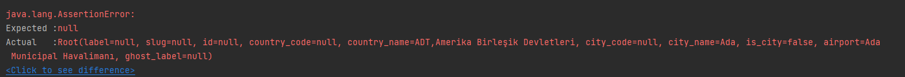
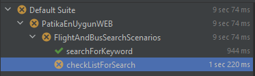
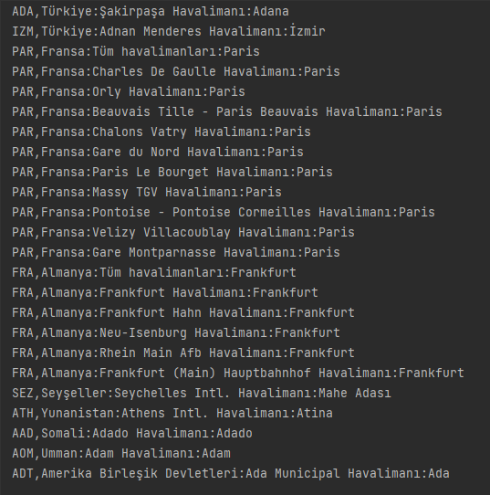
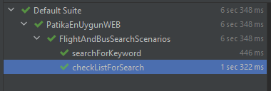

# Assertion Sağlanması

* Kod çalışması sırasında Assert.assertEquals() fonksiyonu ile çalışma yapıldığı zaman Figure 1.1'deki gibi bir sonuç dönmüştür.
* Buna göre boş bir çıktı beklerken aslında belirli çıktılar elde edilmiştir.
* Bu sebeple Figür 1.2'de görüleceği üzere kod çalışması hatalı olmuştur.

```java
  Assert.assertEquals(flightMap.get("ADT"),flightMapAPi.get("ADT"));
```
<p align="center">
    <b>Code 1.1 - assertEquals() code block</b>
</p>

---

<p align="center">
    
<p align = "center">
<b>Fig. 1.1 - Code Result </b>
</p>

---

<p align="center">
    
<p align = "center">
<b>Fig. 1.2 - Test Steps</b>
</p>

<hr style="border:10px solid gray">

* Yukarıdaki hatalı durumu çözmek için ise SoftAssert() kullanılmıştır.
```java
Assertion assertion = new SoftAssert();
assertion.assertEquals(flightMap.get("ADT"), flightMapAPi.get("ADT"));
```
<p align="center">
    <b>Code 1.2 - sofAssert() code block</b>
</p>


---

* Elde edilen Çıktılar ise aşağıdaki temel kod bloğu ekrana yazdırılmıştır.
  * Figür 1.3 uygulama sonrasında elde edilen çıktı mevcuttur.
  * Figür 1.4'te ise test çalışmasının başarılı sonucu mevcuttur.
```java
flightListApi.stream().forEach(item -> {
    System.out.println(item);
});
```
<p align="center">
    <b>Code 1.3 - Code Block for printing all the elements</b>
</p>

---

<p align="center">
    
<p align = "center">
<b>Fig. 1.3 - Test Result</b>
</p>

---

<p align="center">
    
<p align = "center">
<b>Fig. 1.4 - Test Steps</b>
</p>